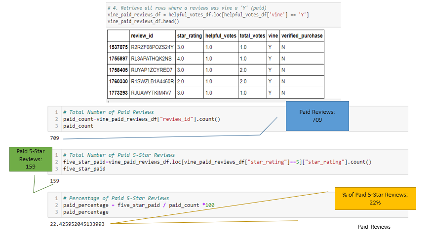
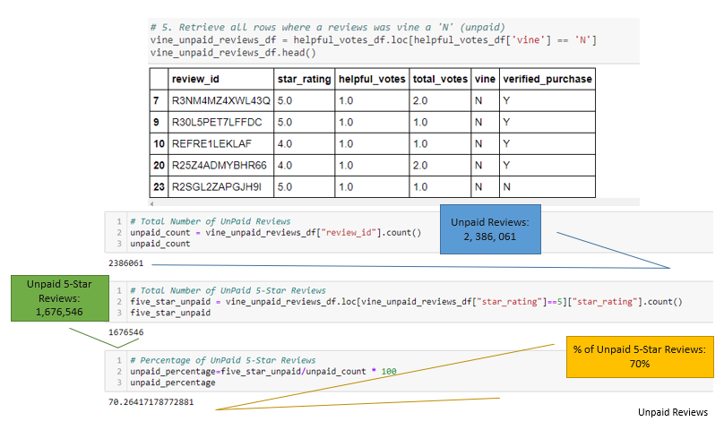

# _A Gift For A Review?_ || Amazon Vine Review Analysis

## Overview of Analysis

$ellBy(SellBy) is on schedule to launch a myriad of products on a major online retailer. In addition to launch, $ellBy(SellBy) stakeholders are looking to enroll in Amazon Vine, an incentivize (invitation-only) review program, where select customers are given a free product to review. 
Having to pay a nominal fee to Amazon to participate, $ellBy (SellBy) is interested in whether partaking in the former would present a potential investment opportunity for the growth of the company. Afterall, the more reviews, namely positive, of a specific product, and/or, like offerings to $ellBy’s (SellBy) competitors, the likelihood there will be success in sales.
To prove or disapprove this assertion, an analysis of unpaid versus Amazon Vine (paid) reviews on music purchases was performed. 

## Resources

* Data Source(s): [Amazon Reviews, Music](https://s3.amazonaws.com/amazon-reviews-pds/tsv/amazon_reviews_us_Music_v1_00.tsv.gz), ["Cleaned"(filtered) reviews dataset](https://app.box.com/s/l831qpxfdjg8dvcy925w7o3x9zd2og48)
* Software/Tools: Python 3.9.2 64-Bit | Python Libraries/Packages: mrjob (MapReduce job), Pandas | VS Code 1.54.3 | Jupyter Notebook** | Google Colab Notebooks | Apache Spark (Spark Dataframes, Spark SQL), PySpark | Amazon AWS, RDS | PostgreSQL | pgAdmin, 4.29
  *  Data Access: Workaround, [Project Jupyter: jupyter nbviewer](https://nbviewer.jupyter.org/), a Jupyter Notebook renderer **
     *    Data may not display properly on GitHub, please use provided workaround

## Results

**Data Gathering _and_ Clean-up**

After gathering, cleaning up and storing of the dataset into a [database (ETL, extract-transform-load analysis)]( https://github.com/SoWhitIs/amazon-vine-analysis/tree/main/images), the next step was to determine the bias on vine versus unpaid reviews.
The next phase of this analysis focused on filtering the dataset of over [4 million reviews](images/pre_filter_review_count.png) based on the following criteria: 

*  The total amount of votes where the count was greater or equal to 20
*  Reviewing all rows where the number of helpful votes divided by total votes were greater or equal to 50 %
* Separating unpaid and paid reviews
* The number of 5 -Star Reviews

**Reviews _By_ The Numbers**

**Paid Vine Reviews**
* Vine Reviews (in total): 709
* 5-Star Vine Reviews: 159
* Percentage of Vine 5-Star Reviews: 22%

 <b><i>Vine Paid Reviews Snapshot</b></i> 
 

 
 

#

**Non-Paid Reviews**
 * Non-paid Vine Reviews (in total): 2,386,061
 * 5 -Star Non-Vine Reviews: 1,676,546
 * Percentage of Non-Vine 5-Star Reviews: 70%

 <b><i>Unpaid Reviews, snapshot</b></i> 
 

 
 

#

## Summary: _Is_ there bias?
In short, with the current dataset, there does not appear to be any inclination that participation in the Amazon Vine program would equate to true value for $ellby (SellBy). 
The difference between Amazon Vine paid reviews, and unpaid reviews is quite substantial. Amazon Vine paid 5-star reviews made up only 22%, while unpaid 5-star reviews accounted for an overwhelming 70%. 

However, a review of one dataset may not be enough to support the above claim, and therefore would suggest performing a few more analyses on various datasets (varying product offerings) based on the on the proceeding observations.  

 Factors to consider: 

(1) Amazon Vine is an invitation-only program by which reviewers are vetted. (More information about the Amazon Vine program can be found, [here.]( https://www.amazon.com/gp/vine/help)) This possibly could have an effect how products are “seen” or distributed for review. 

(2) Type of Product: Current analysis, as mentioned, was done on music purchases. The use-case that music presents will considerably be different from a product that exist for another purpose, i.e., watch, television, etc.  It is likely the ratio of paid versus un-paid reviews could vary across products. 
#
#### Author
_Whitney D. Gardner_

